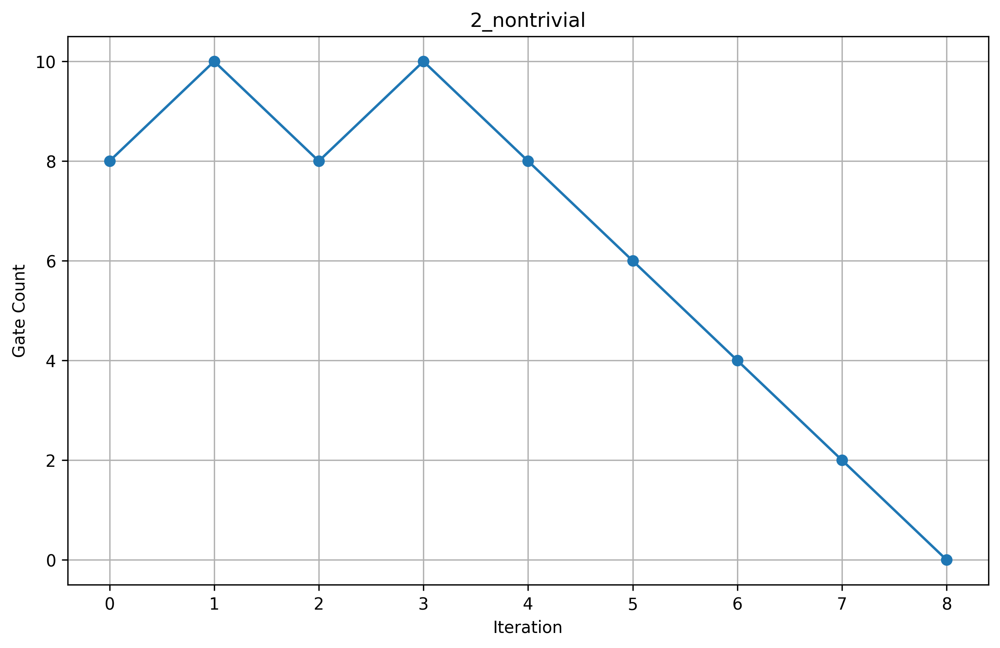

# Phase 1 – Graph Reproduction

## Overview

Phase 1 focuses on reproducing the graphs presented in the reference research paper.

The paper does not explicitly describe the complete process used to generate these graphs. By examining the references provided in the paper, the open-source **RevSCA-2.0** tool was identified as one of the cited resources.

The tool was explored and used to reproduce the reported results and generate the corresponding graphs. The scripts and supporting files used for the reproduction are included in this directory.

## Reproduced Results

### Figure 1

### Comparison

### Additional Results

## Tool Used

[RevSCA-2.0](https://github.com/amahzoon/RevSCA-2.0)
