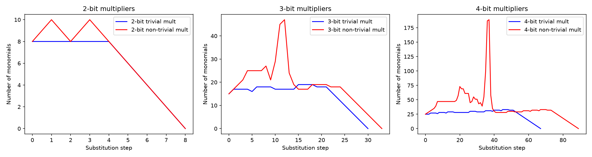
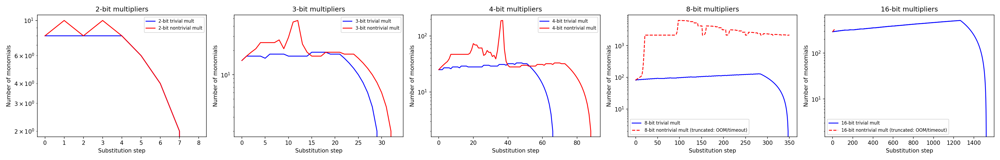
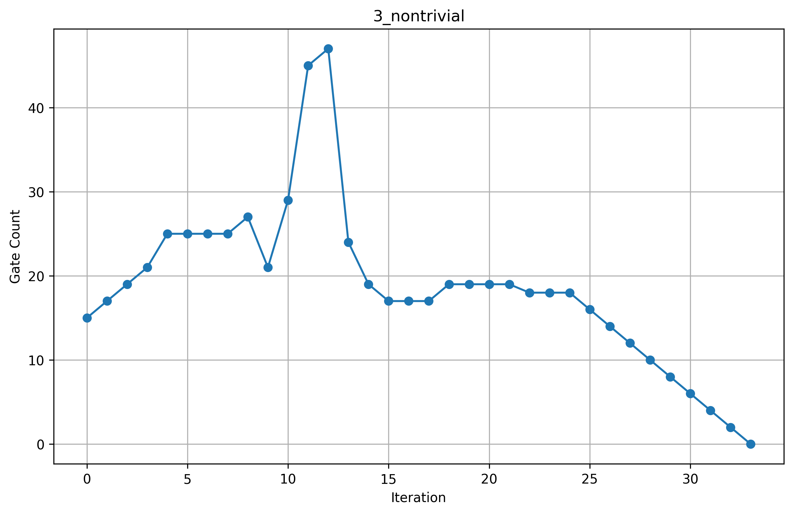
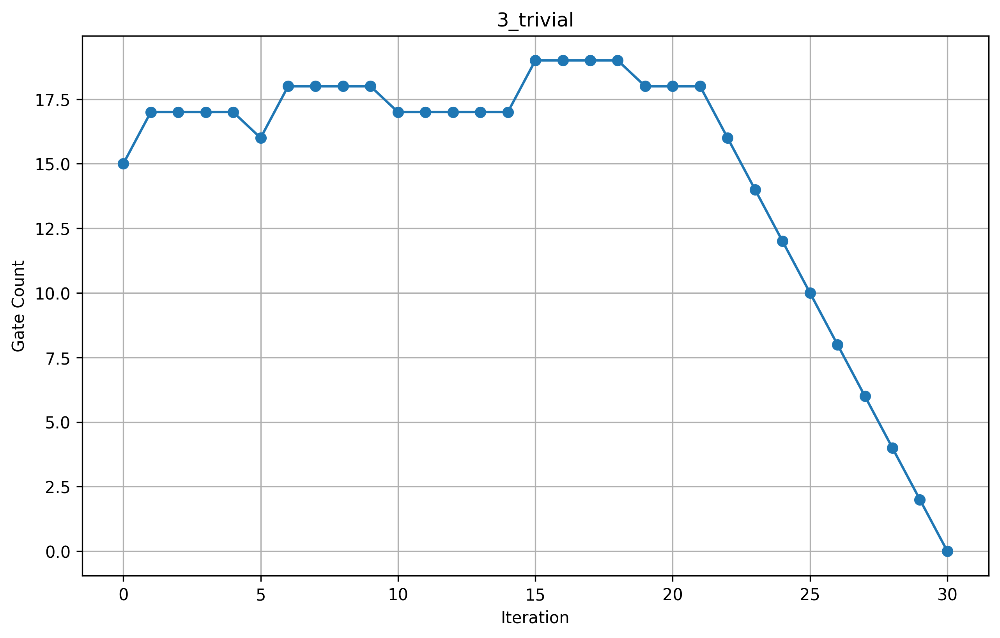
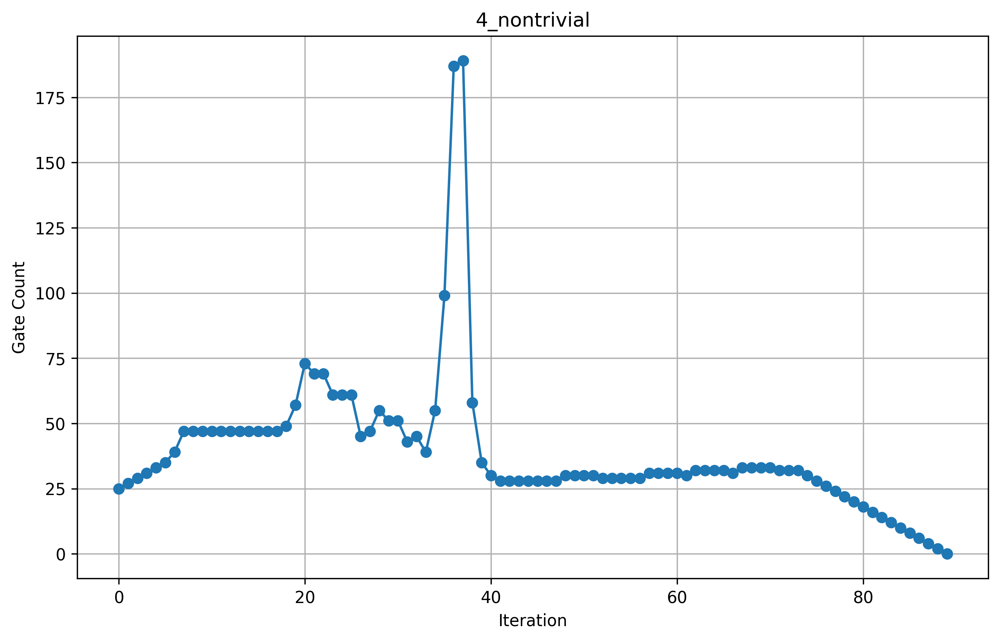

# Phase 1 – Graph Reproduction

This phase focuses on reproducing the graphs presented in the reference research paper using the open-source **RevSCA-2.0** tool.

The reproduced results are shown below.

## Reproduced Graphs

### Figure 1

### Comparison

### Case 2

### Case 3

### Case 4

---

**Tool used:** [RevSCA-2.0](https://github.com/amahzoon/RevSCA-2.0)
